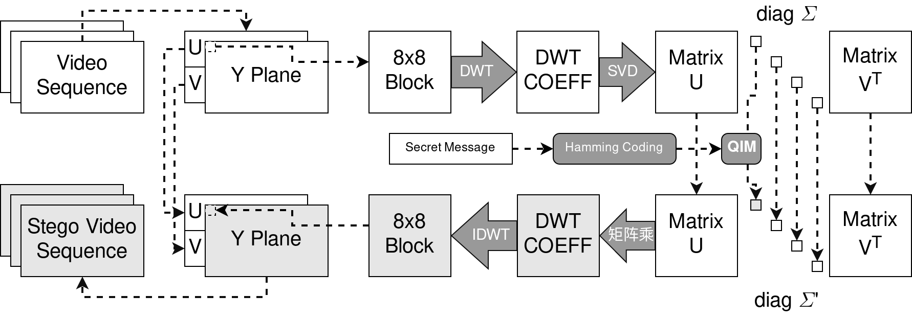

## A program to steg message into video by DWT, SVD, QIM and Hamming Code
The algorithm is partly a reference to the method of Fan et al.[^1]

The algorithm control flow is described in the pic below:

SVD func from OpenCV, DWT func from GSL, and functions for video dealing are from FFmpeg.

OpenCV version: 4.5.5-4; GSL version: 2.7.1-1; FFmpeg version: 2:5.0-6.

Current code can only extract the video stream from the cover video file, stegging and muxing into the stego video file with only one video stream.

### Usage:
- use cmake to compile the code
- \<command\> \<input\> \<key\> \<output\>: to steg into input file
- \<command\> \<input\>: to read message from input file
- \<command\> is ./steg or ./vsteg, steg is for image stegging, and vsteg is for video stegging

[^1]: FAN P, ZHANG H, CAI Y, et al. A robust video steganographic method against social networking transcoding based on steganographic side channel[C]// Proceedings of the 2020 ACM Workshop on Information Hiding and Multimedia Security. 2020: 127-137.
